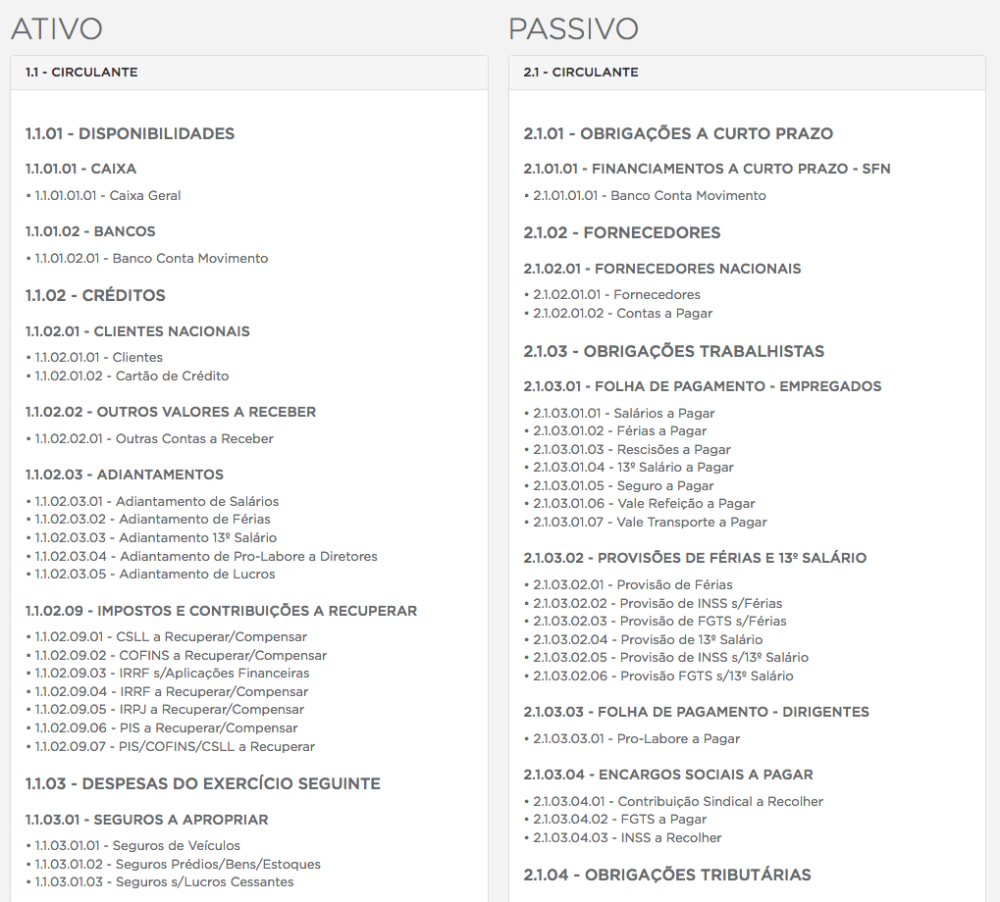
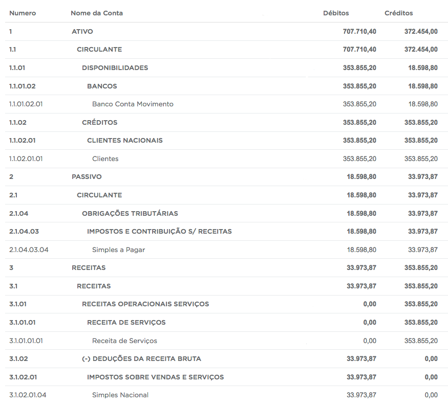

# Introdução

Parabéns, você tem o perfil que procuramos!


O processo de seleção é divido em três etapas: a primeira,  a qual você já passou, foi a filtragem dos currículos. A segunda é o teste contido neste e-mail. A terceira etapa será a entrevista aqui em nosso escritório.

Daremos um prazo de 10 dias para que você possa resolver este problema sem atrapalhar seus compromissos do dia a dia. Você também poderá enviar a resolução caso você conclua antes deste prazo.

O que vamos avaliar em todo o teste: legibilidade do código, performance e a lógica utilizada para resolver o problema.

# Teste 1 - Plano de contas

<strong>O que fazer</strong>: você deve carregar o arquivo ["contas.json"](contas.json) através do NodeJS, este arquivo contém todas as informações que serão usadas para o teste. O JSON contém apenas 1 array que deverá ser manipulado até se tornar um array multidimensional, onde cada CONTA terá seu grupo de CONTAS DESCENDENTES.

Cada posição do array contido em ["contas.json"](contas.json) é um objeto, o qual representa a CONTA que estamos citando no exemplo. Cada objeto (CONTA) possui as propriedades: code, name, credit e debit. O code é a informação que irá indicar as ascendências ou descendências das contas, name é o nome da conta e os valores de credit e debit serão usados apenas segundo teste.


<strong>Exemplo:</strong><br>
<code>1 - ATIVO</code> é pai da conta <code>1.1 - CIRCULANTE.</code><br>
<code>1.1.01 - DISPONIBILIDADES</code> é filha da conta <code>1.1 - CIRCULANTE</code>.

O código que você irá escrever para resolver este problema deverá ser feito sem usar nenhuma biblioteca externa, apenas JavaScript e o resultado final deve ser impresso através do <code>console.log</code>. O formato deverá ser seguir o seguinte modelo:

```
[{
	code: '1',
	name: 'ATIVO',
	children: [{
		code: '1.1',
		name: 'CIRCULANTE',
		children: [{
			code: '1.1.01',
			name: 'DISPONIBILIDADES',
			children: [{
				code: '1.1.01.01',
				name: 'CAIXA',
				children: [{
					code: '1.1.01.01.01',
					name: 'Caixa Geral'
				}]
			},{
				code: '1.1.01.02',
				name: 'BANCOS',
				children: [{
					code: '1.1.01.02.01',
					name: 'Banco Conta Movimento'
				}]
			}]
		}, {
			code: '1.1.02',
			name: 'CRÉDITOS',
			children: [{}]
		}]
	}]
}, {
	code: '2',
	name: 'PASSIVO',
	children: [{}]
}];

```


# Teste 2 - Balancete

Este exemplo é uma evolução do teste 1, consequentemente você poderá aproveitar a lógica utilizada no teste 1 para resolver o problema do teste 2.

<strong>O que fazer</strong>: De forma resumida, balancete é um documento da contabilidade que apresenta os valores de créditos e débitos contido em cada conta, possuindo as seguintes regras:

- O valor do crédito da conta pai é o somatorio dos valores dos créditos das contas filhas
- O valor do débido da conta pai é o somatorio dos valores dos débido das contas filhas
- Contas que não possuem valor de crédito nem de débido não deverão aparecer no balancete.

O resultado final também deve ser impresso através do <code>console.log</code>. O formato deverá ser seguir as três regras citadas e respeitar o seguinte modelo:

```
[{
	code: '1',
	name: 'ATIVO',
	credit: 1300,
	debit: 600
	children: [{
		code: '1.1',
		name: 'CIRCULANTE',
		credit: 1300,
		debit: 600
		children: [{
			code: '1.1.01',
			name: 'DISPONIBILIDADES',
			credit: 1300,
			debit: 200
			children: [{
				code: '1.1.01.02',
				name: 'BANCOS',
				credit: 1300,
				debit: 200
				children: [{
					code: '1.1.01.02.01',
					name: 'Banco Conta Movimento',
					credit: 1300,
					debit: 200
				}]
			}]
		}, {
			code: '1.1.02',
			name: 'CRÉDITOS',
			children: [{
				code: '1.1.02.01',
				name: 'CLIENTES NACIONAIS',
				credit: 0,
				debit: 400
				children: [{
					code: '1.1.02.01.01',
					name: 'Clientes',
					credit: 0,
					debit: 400
				}]
			}]
		}]
	}]
}, {
	code: '2',
	name: 'PASSIVO',
	children: [{}]
}];
```


##Atenção: os dois testes deve ser enviado em arquivos separados, seu email com a resposta deve haver apenas 2 arquivos, um com o algorimo do teste 1 o outro arquivo com o algoritmo do teste 2.

#Apoio

Em anexo está uma representação visual do que é um <strong>Plano de Contas</strong> e um <strong>Balancete</strong>, mas lembre-se que só precisamos que você implemente a sua lógica e o output deve ser um simples <code>console.log</code> a imagem abaixo é apenas para facilitar o entendimento da informação que você vai manipular.

## Plano de Contas


## Balancete

